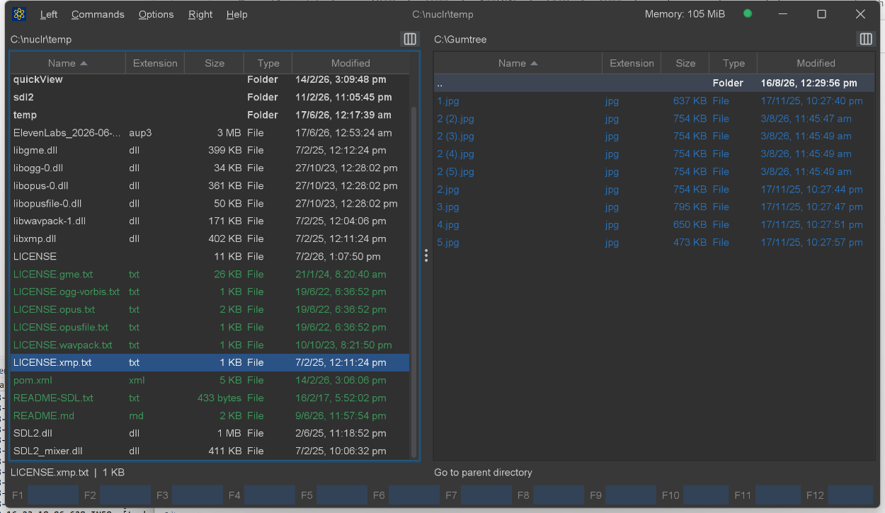
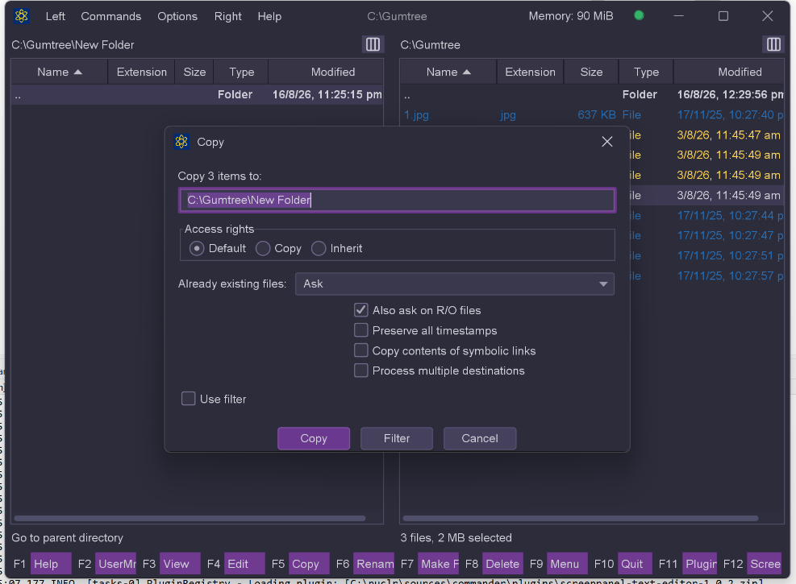

# 🗂️ Local Filesystem Panel

An official [Nuclr Commander](https://nuclr.dev) plugin that adds local drives and mount points as a file panel root. It enumerates roots dynamically from the host OS via `FileSystems.getDefault().getRootDirectories()` — Windows shows `C:\`, `D:\`, etc.; Linux and macOS show `/`.

The bundle ships three plugins: the panel itself, a FAR-style **Temporary Panel** used to hold search results, and a **Quick View** provider for Windows `.lnk` shortcuts.

## Screenshots





## ✨ What it does

| Feature | Details |
|---|---|
| 🖥️ Drive enumeration | Re-enumerates all OS root directories on every drive-menu open, so removable media appears without a restart |
| ⚡ Streaming listings | Entries are published to the panel as they are read, so large folders paint incrementally |
| 📁 File operations | Copy (F5), move/rename (F6), make folder (F7), delete (F8), delete permanently (Shift+F8), create file (Shift+F4) |
| 🔍 Find files | `Alt+F7` — name masks, content search, scopes, filters, streaming results window |
| 💽 Drive information | `Ctrl+L` — volume type, capacity, free space and filesystem details for the current drive |
| 📋 Clipboard | Copy files, copy full paths, and paste (files *or* a path from text) into the current folder |
| 🔗 Symlink resolution | Follows Windows junctions and reparse points (e.g. `C:\Documents and Settings`) to their readable target |
| 📊 Selection summary | Single-item type/size line, or byte / file / folder totals for a multi-selection |
| 🔤 Sorting | Name, extension, modified, created, accessed, size, unsorted, plus the sort dialog (`Ctrl+F3`…`Ctrl+F12`) |
| 📂 Directory walking | Recursive or single-level tree walk with cancellation, used by the host for size and copy scans |
| 📋 Context menu | Open · Reveal in File Manager · Copy file(s) · Copy full path(s) · Delete |
| 🔊 Sound events | Confirmation / error / process-complete / popup cues routed through the host's sound service |
| ⌨️ Go to path | `Ctrl+Shift+G` (Windows/Linux) / `Shift+Cmd+G` (macOS) |

### 🔍 Find File (`Alt+F7`)

A non-modal search dialog and a streaming results window.

| Option | Values |
|---|---|
| Name pattern | Wildcard mask (default `*`) |
| Containing text | `Text`, `Regex` or `Hex` match modes |
| Text options | Case sensitive · whole word · invert match · explicit charset |
| Scope | Current folder · Both panels · Marked items · Volumes · Custom path |
| Traversal | Subfolders · follow symlinks · search inside archives · include hidden |
| `.gitignore` | Optionally skip ignored files, using JGit's real `IgnoreNode` semantics |
| Filters | Modified from/to, min/max size |
| Windows | Optionally search NTFS alternate data streams |

Results stream into a window as they are found. From there you can jump to a hit (the panel navigates to its parent folder and puts the cursor on it) or open the **whole result set in a temporary panel**, where the hits behave like ordinary entries — copy, move, delete, view and edit all work, and `..` returns to the folder the search started from.

### 🔗 Windows Shortcut Quick View

`.lnk` files get a rendered Quick View card showing the shortcut's target, arguments, working directory, icon location, and the link's own metadata — parsed with `mslinks`, with a note when a shortcut carries no standard target path.

## 📥 Installation

Copy the signed plugin archive and detached signature into the Nuclr Commander `plugins/` directory:

```text
filepanel-fs-<version>.zip
filepanel-fs-<version>.zip.sig
```

Nuclr Commander verifies the RSA-SHA256 signature against `nuclr-cert.pem` on load. The plugin becomes available immediately without a restart.

## 🔨 Building

```bash
# The SDK must be installed to the local repo first
cd ../../../plugins-sdk && mvn clean install

cd ../plugins/core/filepanel-fs
mvn clean verify -Djarsigner.storepass=<password>
```

The build produces `target/filepanel-fs-<version>.zip` and a detached `.zip.sig`. Signing needs the keystore at `C:/nuclr/key/nuclr-signing.p12` (alias `nuclr`).

Unit tests run headless on every build. The AssertJ-Swing GUI tests (`**/*GuiTest.java`) need a real, focused display and run only under `-Pgui-tests`.

## ⚙️ How it works

`LocalFileSystemPlugin` registers as a `FilePanelNuclrPlugin`. It claims a resource only when the path belongs to the **default** filesystem — a mounted SFTP server (`filepanel-net`) or a zip archive (`filepanel-zip`) answers `Files.isDirectory()` just as truthfully, and claiming those would misroute a cross-panel move. F6 therefore moves into the opposite panel only when that panel's folder is a real local directory; otherwise it degrades to an in-place rename.

Two methods the host calls on the EDT — `menuItems()` and `getSelectionSummaryText()` — deliberately never touch the filesystem. They answer from the attributes each entry already carries, because a single `stat` there costs the full spin-up of a sleeping HDD while nothing paints.

Deletes show a confirmation listing the full paths, then run on a virtual thread behind a progress dialog. Copy and move each have a setup dialog, a conflict dialog, and a progress dialog with pause-aware cancellation.

## 🗂️ Source layout

```text
src/main/java/dev/nuclr/plugin/core/panel/fs/
├── LocalFileSystemPlugin.java    plugin entry point, action routing
├── TempFilePanelPlugin.java      FAR-style temporary panel over an arbitrary hit list
├── QuickViewLnkPlugin.java       Quick View for Windows .lnk shortcuts
├── FileNuclrResource.java        NuclrResource wrapper for local files
├── Helper.java                   resource building, symlink resolution, reveal-in-file-manager
├── PluginActions.java            action-type constants
├── SystemOpen.java               OS "open with default application"
├── SoundEvents.java              host sound cues
├── DriveInfoService.java         volume capacity / filesystem probe
├── DriveInfoDialog.java          Ctrl+L drive information UI
├── DeleteDialogs.java            delete confirmation / error dialogs
├── DeleteProgressDialog.java     deletion progress UI
├── find/
│   ├── FindFileDialog.java       Alt+F7 search dialog
│   ├── FindFileRequest.java      immutable search specification
│   ├── FindFileContext.java      panel-agnostic dialog inputs
│   ├── FindFileService.java      streaming search execution
│   ├── FindResultsWindow.java    live results window
│   ├── ScopeType.java            search scopes
│   ├── ContentMatchMode.java     Text / Regex / Hex
│   ├── GitIgnoreMatcher.java     JGit IgnoreNode evaluation
│   ├── GitIgnoreProbe.java       repository / ignore-file discovery
│   ├── LocalResourceNavigator.java
│   ├── ResourceBrowser.java
│   └── ResourcePathParser.java
└── service/
    ├── Alerts.java
    ├── ClipboardService.java     copy files / full paths, paste
    ├── CopyService.java          copy entry point, clipboard paste
    ├── CopyEngine.java           scan + byte-copy loop with cancellation
    ├── CopyOptions.java · CopyDialog.java · CopyConflictDialog.java · CopyProgressDialog.java
    ├── DeleteService.java        recycle-bin and permanent delete
    ├── MakeNewFolderService.java
    └── move/
        ├── MoveService.java · MoveEngine.java · MoveOptions.java
        └── MoveDialog.java · MoveConflictDialog.java · MoveProgressDialog.java
```

## 📚 Dependencies

Most dependencies are provided by Nuclr Commander at runtime. Only the two `compile`-scoped libraries below are bundled into the plugin ZIP's `lib/`.

| Library | Version | Scope | Purpose |
|---|---|---|---|
| `dev.nuclr:platform-sdk` | `3.0.2` | provided | Nuclr platform interfaces |
| `commons-io` | `2.22.0` | provided | Human-readable sizes, file utilities |
| `org.apache.commons:commons-lang3` | `3.20.0` | provided | OS detection |
| `com.formdev:flatlaf` (+ `flatlaf-extras`) | `3.7.1` | provided | Themed Swing components |
| `org.slf4j:slf4j-api` | `2.0.17` | provided | Logging |
| `org.projectlombok:lombok` | `1.18.42` | provided | Annotations |
| `org.eclipse.jgit` | `6.10.0` | **bundled** | `.gitignore` semantics for Find File |
| `org.jabref:mslinks` | `1.2` | **bundled** | Windows `.lnk` parsing |

## 📜 License

Apache License 2.0 — see [LICENSE](LICENSE).
